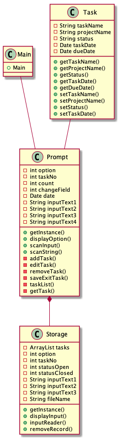
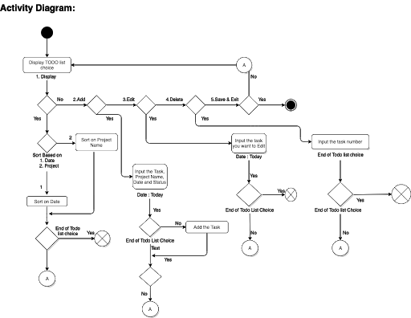

## ToDoly 

# Overview

ToDoly helps users to register/de-register the tasks and set the priority , the task are listed by priority or Date. It is a good tool where users can get rid of the manual work.
User can also keep track of already done list, modify existing list whenever user wants.

# Prerequisites

* IntelliJ IDEA 2019.3.3
* java version "13.0.2"
* Text file for storing and retrieving data

# User Manual

Under development

# Class Diagram

# Activity diagram

# Running tests
