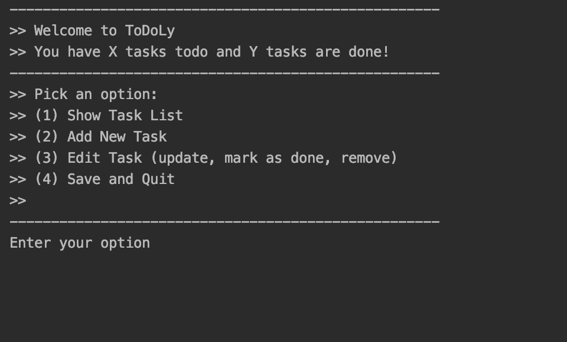
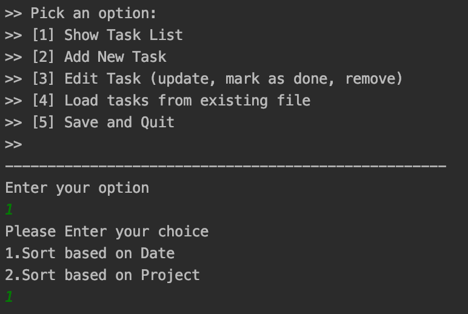
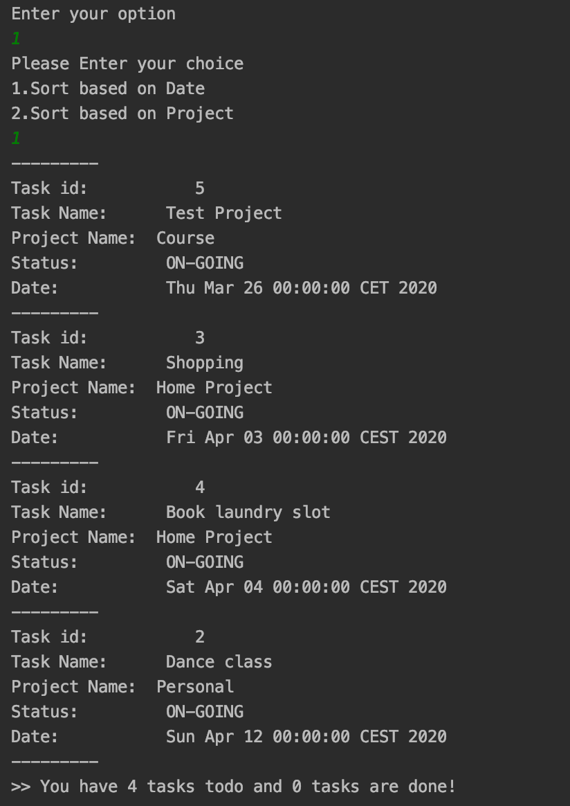
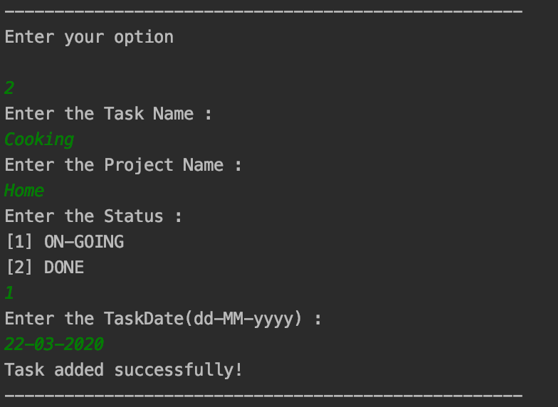
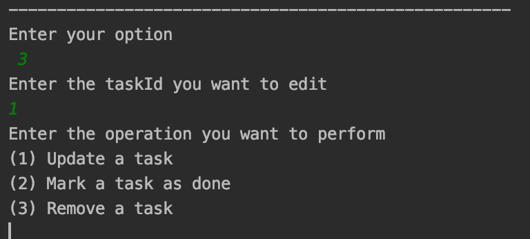
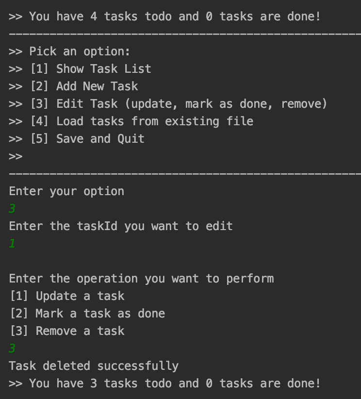
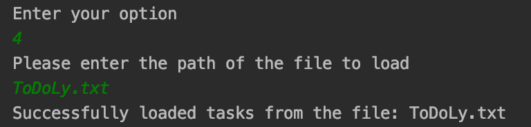
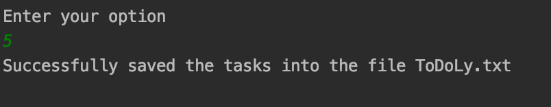

# ToDoLy Application

ToDoLy application is Text based user Interface.

## Required Software to be Installed:

 * JDK 8
 * IntelliJ IDEA 2019.3.3
 * Text file for storing and retrieving data.

## Storage:
ToDoLy application uses "ToDoLy.txt" text file for storing and retrieving data. The input file will be generated in the same directory where the "ToDoLy" application run.

## Display Task List

List of option that has to be performed on *ToDoLy* will be displayed.

### Sort

When "Show all Tasks" is selected, choose the option whether to sort the list based on Date or by Project name.

### Status of Task

Displays the list of task with details about how many tasks are "**_ON-GOING_**" and how many are "**_DONE_**".

## Adding New Task

Choose the option **2** to add new Task details.

## Editing a Task

Choose the option **3** to Edit the Task details.Choose the fields of the task you want to edit.

To edit the Date field, choose the date **Greater than** or **Equal to today** date, otherwise it throws error message "Date Entered should be greater than today".

#### Delete a Task

ToDoLy application will ask for the corresponding Task No that has to be deleted.

## Load tasks from Existing file

ToDoLy application asks for the path of the file to be loaded and it must be generated by ToDoLy application.

## Save and Quit

Choose the option **5** to save and Exit from ToDoLy Application.The actions performed on Todo list data are saved to "ToDoLy.txt" file.

